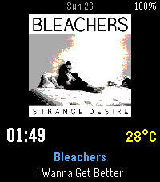
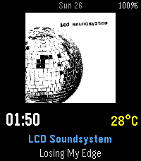

# Pulse.fm

A Pebble Time 2 (Emery) watchface that shows the album art, track, and artist
of what you've been listening to on Last.fm — with a fallback chain when
artwork is missing and a configurable refresh interval.

## Screenshots

<p>
  
  
</p>

## Features

- Now-playing track from Last.fm (or last scrobble when nothing's playing)
- Album cover (128×128, color-quantized to Pebble's 64-color palette)
- Image fallback: track → album → artist → bundled cover
- Time, date, battery, BT-disconnected indicator
- Temperature from Open-Meteo (no API key, GPS via phone)
- Timeline Quick View aware (re-centers time when peek is showing)
- Configurable via Clay (Last.fm credentials, refresh interval, display
  toggles)

## Platform

**Pebble Time 2 (Emery) only.** 200×228 color screen.

## Prerequisites

- Pebble SDK installed locally (`pebble-tool` via uv, then `pebble sdk install latest`)
- Node.js (for npm dependencies)
- A Last.fm account and API key from https://www.last.fm/api/account/create
  (the callback URL field is unused — put anything, e.g. `http://localhost`)

## Build

```bash
npm install            # one-time, installs jpeg-js@^0.3.x and pebble-clay
pebble build           # produces build/pulse-fm.pbw
```

Use `pebble clean && pebble build` after editing `messageKeys` in
`package.json` (the SDK caches the generated `message_keys.h`).

## Install on a real Pebble Time 2

1. Open the Pebble app on your phone.
2. **iOS:** menu → Settings → enable Developer Mode → Developer → enable
   Developer Connection.
   **Android:** ⋮ → Settings → enable Developer Mode → tap Developer
   Connection → ON.
3. Note the Server IP shown in the app.
4. Make sure your Mac and phone are on the same Wi-Fi network.
5. From this directory:
   ```bash
   pebble install --phone <server-ip>
   ```
6. On the phone's Pebble app, open Pulse.fm's settings (gear icon) → enter
   Last.fm username + API key → Save. The watchface should populate within
   a few seconds.

### Logs from the watch

```bash
pebble logs --phone <server-ip>
```

App-side logs are prefixed `[pulse.fm]`.

### Screenshots from the watch

```bash
pebble screenshot --phone <server-ip> --no-open shot.png
```

Watchface needs to be on screen when you run this.

## Iteration loop

```bash
pebble build && pebble install --emulator emery   # quick on emulator
pebble build && pebble install --phone <server-ip> # on the real watch
```

If the emulator gets stuck, `pebble kill && pebble install --emulator emery`
relaunches it cold (~30–60s boot).

## Testing in the emulator (with credentials)

The Clay configuration page works on a real phone but is unreliable in
`pypkjs` (the emulator's PKJS host) — `webviewclosed` doesn't always fire
back. To test the full Last.fm flow on the emulator, inject the credentials
directly into PKJS's `localStorage`:

1. Make sure the watchface is installed and running:
   ```bash
   pebble install --emulator emery
   ```

2. Open a JS REPL inside the emulator's PKJS:
   ```bash
   pebble repl --emulator emery
   ```

3. Paste, replacing the placeholders with your real values:
   ```js
   localStorage.setItem('clay-settings', JSON.stringify({
     LastfmUsername: 'YOUR_USERNAME',
     LastfmApiKey:   'YOUR_32_CHAR_API_KEY',
     RefreshMinutes: '1',
     TempUnit:       false,
     ShowDate:       true,
     ShowBattery:    true
   }));
   ```

4. Verify it stuck:
   ```js
   JSON.parse(localStorage.getItem('clay-settings'));
   ```

5. Wait up to one minute (the watch sends `RefreshNow` on its own tick).
   In another terminal:
   ```bash
   pebble logs --emulator emery
   ```
   Expected sequence on each refresh:
   ```
   [INFO] tick: requesting refresh (interval=1)
   [pulse.fm] refresh requested by watch
   [pulse.fm] polling for user YOUR_USERNAME
   [pulse.fm] track: <artist> - <song>
   [pulse.fm] image: downloading https://...
   [pulse.fm] image: transfer complete
   [INFO] image complete -> bitmap 128x128 swapped in
   ```

`pebble kill` wipes the emulator's `localStorage`, so you'll need to repaste
the snippet after relaunching the emulator.

### Useful emulator commands

```bash
pebble screenshot --emulator emery --no-open shot.png    # capture
pebble emu-set-timeline-quick-view --emulator emery on   # simulate peek
pebble emu-bt-connection --emulator emery disconnected   # simulate BT off
pebble emu-battery --emulator emery --percent 15 --charging false
pebble kill                                              # stop emulator
```

## Image fallback chain

When the user is listening to track *T* by artist *A* on album *Alb*, PKJS
tries each in order and stops at the first that yields a non-placeholder
image URL:

1. `track.image[]` from `user.getrecenttracks` (extralarge first)
2. `album.image[]` from `album.getInfo(A, Alb)`
3. `artist.image[]` from `artist.getInfo(A)`
4. The bundled `FALLBACK_COVER` resource (currently the FLUXUS by Futuremen
   cover at 128×128, in `resources/images/fallback.png`). PKJS sends
   `ImageSkipped: 1` and the watch renders the bundled bitmap.

Placeholders are detected by matching the URL's hash against a
hand-maintained list in `src/pkjs/lastfm.js#PLACEHOLDER_HASHES`. New
placeholder hashes can be added there as they're spotted.

## Project layout

```
pulse-fm/
├── package.json              targetPlatforms, messageKeys, Clay config
├── wscript                   waf build script
├── resources/
│   └── images/fallback.png   bundled fallback cover (128×128)
└── src/
    ├── c/
    │   └── pulse-fm.c        watchface — layers, drawing, AppMessage,
    │                         settings persistence, tick handler driving
    │                         the refresh schedule
    └── pkjs/
        ├── index.js          PKJS entry — Clay init, polling on
        │                     RefreshNow, message routing
        ├── lastfm.js         Last.fm REST client + fallback chain
        ├── weather.js        Open-Meteo client
        ├── image_transfer.js JPEG decode + 8bpp quantize + chunked
        │                     AppMessage (with stuck-pipeline recovery)
        └── clay-config.js    Clay settings UI definition
```

## Refresh model

The watch's `tick_timer_service` (which always fires every minute, even when
the phone is asleep) drives the schedule. After every N ticks (where N is
the user-configured `RefreshMinutes`), the watch sends an outbound
`RefreshNow` AppMessage. PKJS reacts by re-fetching Last.fm + weather and
pushing fresh data back. PKJS does not run its own timer — that was
unreliable because the phone OS suspends PKJS between AppMessage events.

## Known PKJS gotchas

- Modern npm packages with ES6+ syntax break the SDK's bundler. Keep
  dependencies on ES5-era versions (e.g., `jpeg-js@^0.3.7`).
- Clay's auto-handler writes settings to `localStorage['clay-settings']` on
  submit; the watch reads display-related fields, PKJS reads credential
  fields. There is no parallel persistence.
- PKJS can be suspended mid-callback. Module-level "in progress" flags need
  a timestamp escape hatch (see `image_transfer.js#STUCK_TIMEOUT_MS`).
